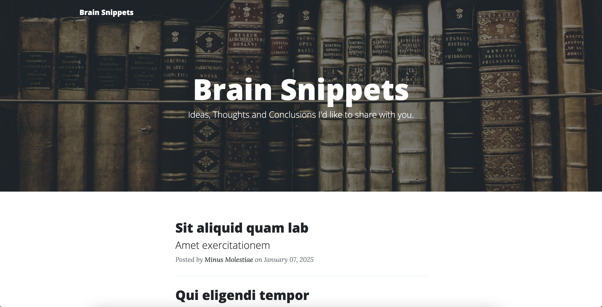
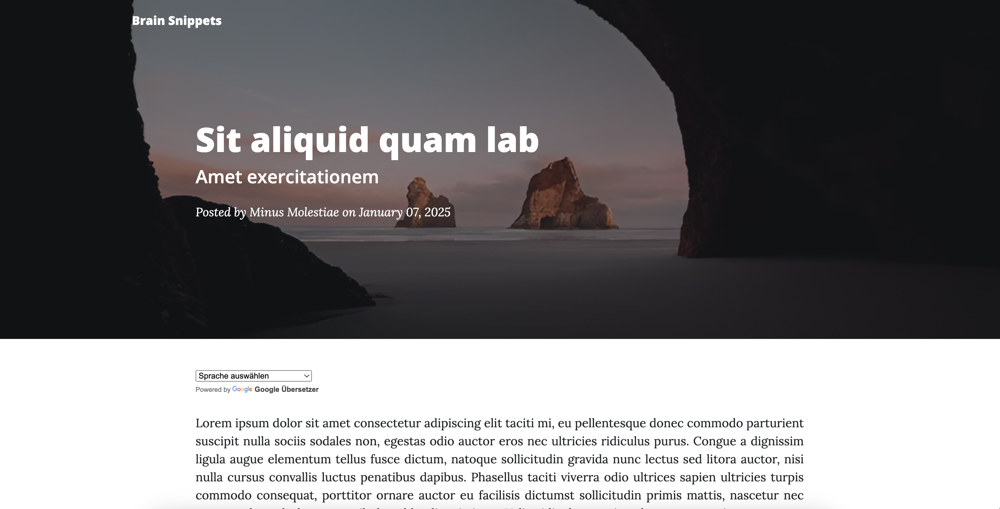
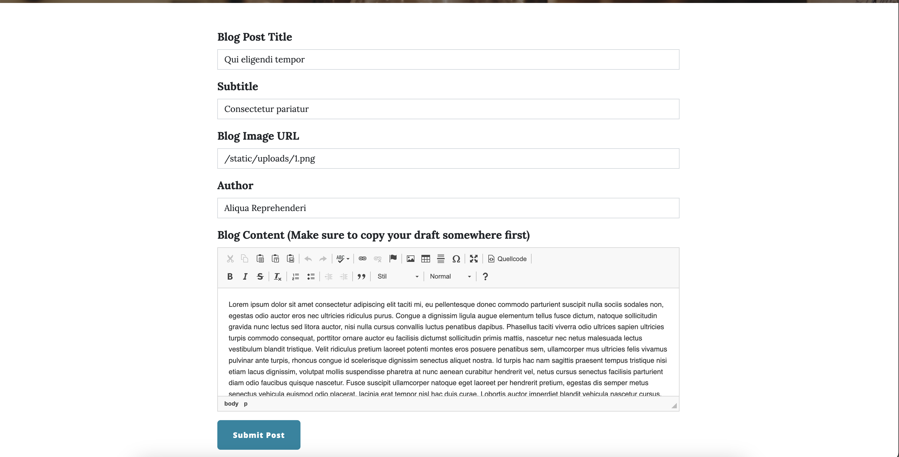

<h2 align="center">Blog Boiler Lite</h2>
<p align="center">A lightweight Flask-based boilerplate for creating a blog, utilizing n:point for simple data storage.</p>
<p align="center">


</p>

<table>
	<tbody>
		<tr>
			<td width="33%">
				Home
				
			</td>
         <td width="33%">
				Post Page
				
			</td>
			<td width="33%">
				Post Panel
				
			</td>
		</tr>
	</tbody>
</table>


## Intention

This project is a simple blog implementation, designed for users who prefer a straightforward solution. If you require additional features like user management, an admin interface, or database storage, consider checking out [the pro version](https://github.com/timonrieger/blog-boiler-pro.git).

## Features

- **Create, Edit, Read Blog Posts:**
- **Pagination:** View posts with pagination for better navigation and user experience.
- **User-Friendly Text Editor:** A simple and intuitive editor for creating and editing blog posts provided by CKEditor 4.
- **Data Storage with n:point:** All blog content is stored and managed using n:point's json bin functionality.
- **Responsive Design with Bootstrap:** The site automatically adjusts to various screen sizes and devices for seamless usability.
- **Google Translate Support:** Allow posts to be translated from your writing language to other languages. To disable, set the `ENABLE_TRANSLATIONS=False` in `src/config.py`.
- **Collaboration Support:** Share your n:point credentials with co-authors to collaborate on blog posts.
- **Secure, SEO Optimized, and Fast:** Optimized for performance and search engine visibility according to [Checkbot](https://checkbot.io/).
- **Customizable About Page:** Personalize an "About" page for each author to share their story or expertise.

## Limitations

- No user management
- No admin panel
- No commenting system
- Manual content saving
- No extension or plugin system
- Pages written English (can be translated manually, though)
- No analytics by default (which I regard as positive)

## Setup

1. **Clone the repository**
   ```
   git clone https://github.com/timonrieger/blog-boiler-lite.git
   ```

2. **Navigate to the project directory**
   ```
   cd blog-boiler-lite
   ```

3. **Create a virtual environment**
   ```
   python -m venv venv
   ```

4. **Activate the virtual environment**
   - On Windows:
     ```
     venv\Scripts\activate
     ```
   - On macOS/Linux:
     ```
     source venv/bin/activate
     ```

5. **Install the required dependencies**
   ```
   pip install -r requirements.txt
   ```

6. Set the required **environment variables** in a `.env` at the root directory. 
   [Clone my json bin first](https://api.npoint.io/c2cd65fcb9eb06f444de) and find the URL of your bin at the bottom of the page.
   ```
   SECRET_KEY=yoursecretkey
   NPOINT=yournpointid # e.g. for https://api.npoint.io/c2cd65fcb9eb06f444de it's c2cd65fcb9eb06f444de

7. **Run the application**
   ```
   python -m main
   ```
   Now go to http://127.0.0.1:5000/ and have look around

## Your First Blog Post
1. **Create a New Blog Post**
   - Go to http://127.0.0.1:5000/new. This will open the form to write a new blog post.
   - Fill the form with your content.

2. **Add Images to Your Blog Post**
   - Upload your image to the `static/uploads/` directory.
   - To display the image in the blog post, use the following HTML code in your post content or add the URL in CKEditors image interface:
     ```
     <p></p>
     ```
   
3. **Set Blog Image URL**
    - For the field `Blog Image URL` field, use the path of the uploaded image, e.g., `/static/uploads/3.png`.


4. **Submit the form**

> **Warning**: Before submitting the form, copy the source HTML code to avoid data loss in case `pyperclip` fails. You can usually go back in the browser to load the filled form again, though.

5. **Update the JSON Bin**
   - Paste the content from your clipboard at the top of your JSON bin.
   - Change the `id` field as needed.
   - Save the changes and rerun the application.
   - Backup the json bin


## Configuration

1. **Add Images**  
   Add the images you want to use in the `static/uploads/` directory with your image files (I personally name the files with [autoincrementing numbers](https://github.com/timonrieger/blog/tree/main/static/uploads)). 

2. **Backup JSON Content**  
   After modifying the `n:point` JSON bin, it's highly recommended to back up the JSON content stored in `static/assets/content/backup-latest.json`. 
   
   - You can either replace the older backups or rename them with a date-based format (e.g., `backup-07012025.json`).
   - This backup prevents data loss if something happens to your `n:point` bin, and ensures you have access to content in case the bin is temporarily unavailable.

3. **Modify Static Assets**  
   Feel free to modify the following directories and files:
   - `static/assets/img/` (for images)
   - `static/assets/favicon.ico` (for the site favicon)

4. **Modify SEO contents**  
   Replace the contents at the top of each file in the `templates/`
   directory to reflect your content.


## Endpoints

- **Home**: `/` - View all blog posts.
- **Post**: `/<post_title>` - View a single blog post.
- **New Post**: `/new` - Create a new blog post.
- **Edit Post**: `/edit/<int:post_id>` - Edit an existing blog post. Use the id you set for it in your json.

## Requirements

- Python 3.x
- The following Python packages (as listed in `requirements.txt`):
  - Bootstrap_Flask==2.2.0
  - Flask_CKEditor==1.0.0
  - Flask_WTF==1.2.1
  - WTForms==3.0.1
  - Flask==2.3.2
  - gunicorn==22.0.0
  - requests==2.31.0
  - pyperclip==1.8.2
  - python-dotenv==0.19.1

## License

This project is licensed under the MIT License. See the [LICENSE](LICENSE) file for details.